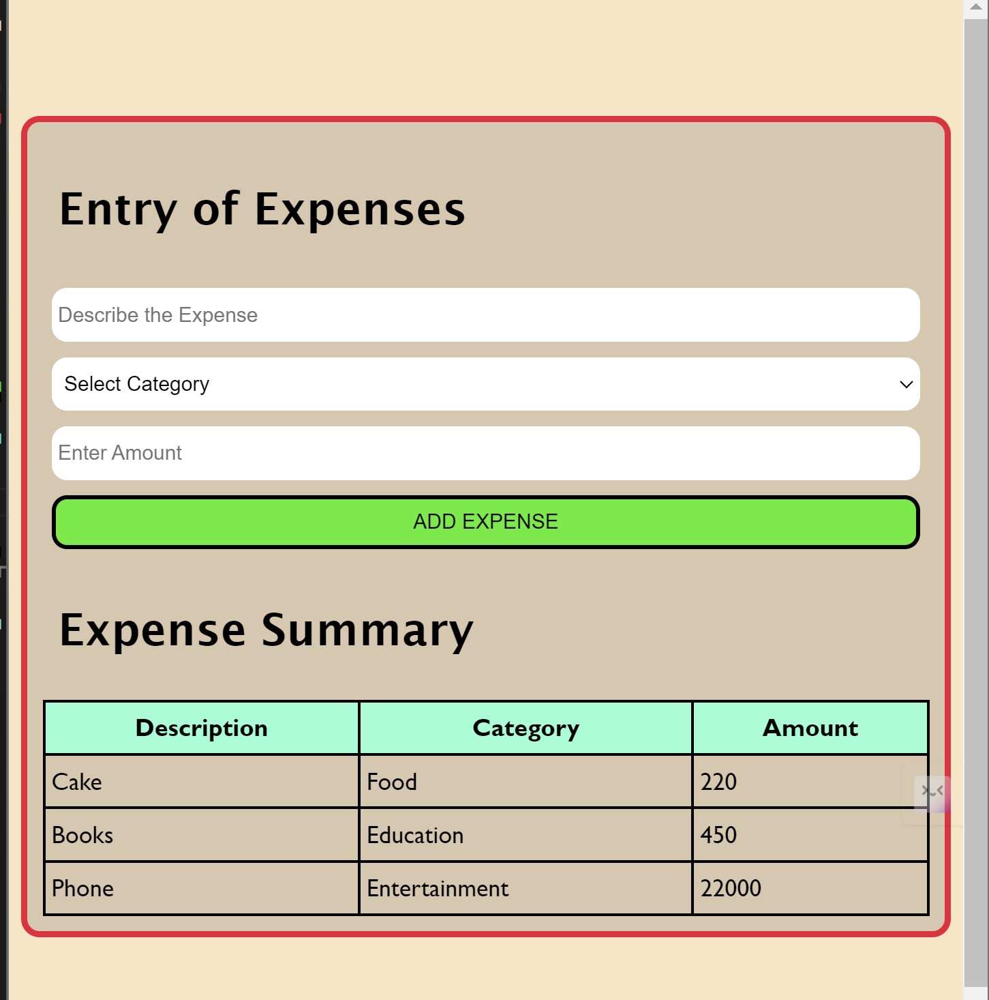

# Expense-Tracker
Expense Tracker is a simple and user-friendly web application designed to help you keep track of your expenses. You can record your expenses by providing a description, selecting a category, and specifying the amount. The application summarizes all your expenses, giving you a clear view of your spending habits.

<p align ="center">
    
    <a href="https://kc1064.github.io/Expense-Tracker/" >[CLICK HERE FOR DEMO]</a>
</p>

## Features

- Add new expenses with a description, category, and amount.
- View a summary of all recorded expenses.
- Categorize expenses for better tracking and analysis.

## Installation

1. **Clone the repository:**
   ```bash
   git clone https://github.com/yourusername/expense-tracker.git
   ```
2. **Navigate to the project directory:**
   ```bash
   cd expense-tracker
   ```

## Usage

1. **Open the application** in your browser by navigating to `http://localhost:3000` (or the appropriate URL if deployed).

2. **Add a new expense**:
   - Enter a description of the expense.
   - Select a category from the dropdown menu (e.g., Food, Travel, Entertainment, etc.).
   - Enter the amount spent.

3. **Submit the expense** by clicking the "Add Expense" button. The expense will be added to the summary.

